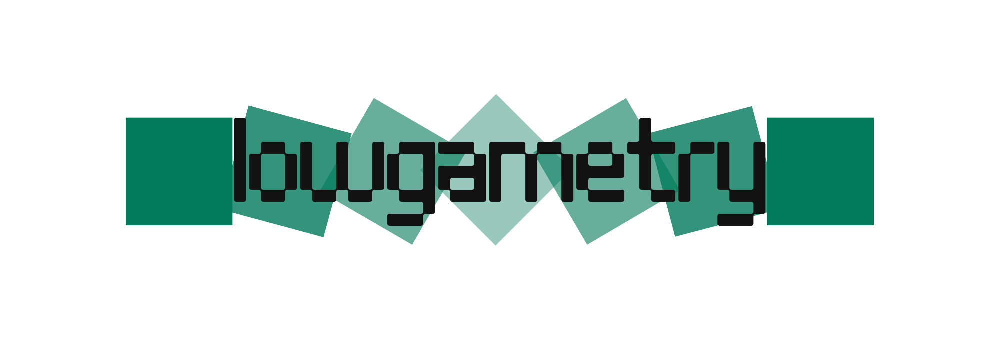

  <picture>
    <source media="(prefers-color-scheme: dark)" srcset="web/src/assets/logo.png">
    
  </picture>

Turn a handful of photos of an object into a **low-poly 3D model** you can drop
straight into a game or Blender.

The site is just the interface. All the heavy lifting, the actual
reconstruction, runs on the **Windows engine that you download and run
yourself**. Your photos are read by that engine on your own machine and never
leave it. No upload.

What the engine does with your photos, step by step:

1. **COLMAP** works out where each photo was taken (structure-from-motion).
2. **OpenMVS** turns that into a dense point cloud, then a mesh, then a texture.
3. The mesh gets **decimated and auto-retopo'd** down to low poly, and the detail
   is **baked** back into the texture.
4. You get a `.glb` to spin in the browser and download as `.glb` or `.obj`.

The browser and the engine only ever talk over `127.0.0.1`. The site finds the
engine on its own; if it isn't running, the site still opens and just works as a
showcase until you launch it.

## How to use it

1. Download and run the engine, then hit **Turn engine on**.
2. Open the site. Drop 20-60 photos of your object (or a video, it splits into
   frames for you).
3. Reorder / trim the shots in the organizer, pick a mode and quality, and hit
   generate.
4. Watch the progress, then spin the result around in the viewer and download
   the `.glb` or `.obj` (with textures).

Photos matter far more than settings. There's a short
[capture guide](docs/captura.md). 

The one-liner is: walk around the object in small steps with ~70% overlap, keep the light steady, and avoid shiny or featureless surfaces.

## Two modes

- **Low poly**: 300 to 3000 faces, tiny textures (128-512px), nearest-neighbour
  filtering, a crunched 32-colour palette with dithering and flat shading.
- **Normal photogrammetry**: 8k to 60k faces, big textures (1k-4k) and normal
  maps, for when you want the faithful scan instead. but then you can just use meshroom or something else.

## Stack

- **web/**: React, Vite, Tailwind, three.js (`@react-three/fiber` + `drei`).
  Static, deploys to GitHub Pages.
- **engine/**: the Go side. An HTTP server on `127.0.0.1:8757`, a native Windows
  tray window, and the orchestrator that drives COLMAP → OpenMVS → Blender.
- **engine/ferramentas/**: third-party binaries (COLMAP, OpenMVS, Blender)
  bundled into the release, not committed raw.
  
## Hardware info

CPU by default so it runs on any Windows PC; it speeds up with CUDA/NVIDIA when
it's there.

I been running on windows, on a ryzen 7 5700G with 16gb ram. Its been working fine.

If anyone actually runs this on their pc i'd love to know how it worked out.

In development. The real pipeline (COLMAP → OpenMVS → Blender) runs end to end
and the engine has its tray window. What's left is publishing the site and
cutting the first engine release.
